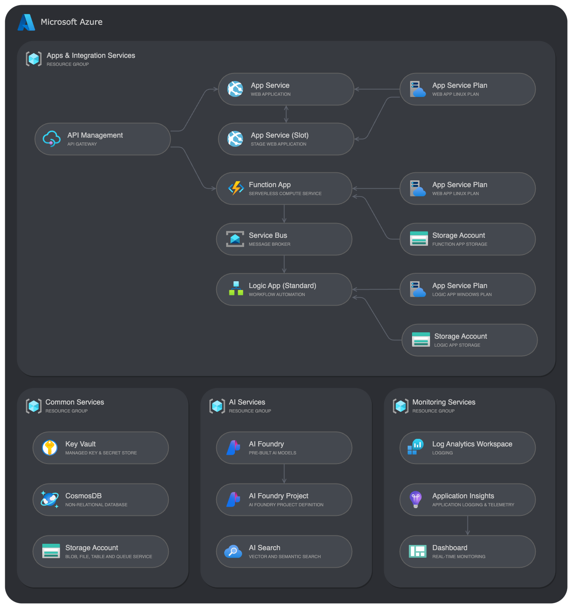
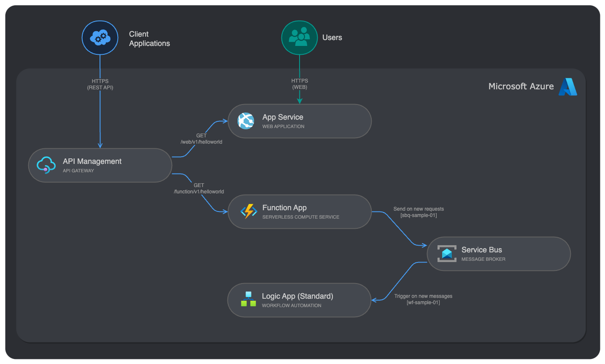

# Azure Apps & Integration Sandbox

[](https://codespaces.new/ffilardi-insight/azure-apps-integration-sandbox) [](https://vscode.dev/redirect?url=vscode://ms-vscode-remote.remote-containers/cloneInVolume?url=https://github.com/ffilardi-insight/azure-apps-integration-sandbox)

[Features](#2-features) • [Getting Started](#3-getting-started) • [Quickstart](#4-quickstart) • [Guidance](#5-guidance)

## 1. Overview
This template provides a complete foundation for building scalable AI-powered applications and integration solutions on Azure with proper security, monitoring, and API management practices. All services, configurations and samples are available via infrastructure-as-code using Bicep modules.

The deployment follows a multi-resource group design with the following services:



## 2. Features

### 2.1 Services

#### Apps & Integration Services
- **Web App:** Sample Python app deployed to App Service, including a staging slot and the routes `/` (sample web page), `/api/helloworld` (sample API endpoint) and `/health` (health check endpoint).
- **Function App:** Sample Python Azure Function (HTTP trigger) exposing `/api/helloworld` returning Python runtime info and publishing a message to a Service Bus queue (`sbq-sample-01`) for every request. The enqueued payload includes timestamp, method, URL and all inbound HTTP headers.
- **Logic App (Standard):** Sample stateful workflow (`wf-sample-01`) triggered by messages in the Service Bus queue `sbq-sample-01` (peek-lock). Implements a simple try/catch pattern: the Try scope completes the message; on failure the Catch scope dead‑letters the message and terminates the run as Failed.
- **API Management:** Publishes both backends with versioned routes `/web/v1/helloworld` and `/function/v1/helloworld` secured via subscription key.
- **Service Bus:** Deploys a namespace account with one sample queue (`sbq-sample-01`) and one sample topic (`sbt-sample-01`).

#### AI Services
- **AI Foundry** with a sample project (`proj-sample-01`) and the following model deployments: GPT-4o, GPT-4.1 and text-embedding-3-small (GlobalStandard SKUs).
- **AI Search** with semantic search set to Free tier for experimentation.

#### Common Services
- **Key Vault** for secret management.
- **Cosmos DB** account with sample database (`database-01`) and container (`db-01-container-01`).
- **Storage** account including blob, queue, table and file services.

#### Monitoring Services
- **Log Analytics workspace** and **Application Insights** wired to all apps to capture logs and telemetry data.
- **Dashboard** for real-time monitoring using Application Insights data.

> [!NOTE]
> All apps are deployed with individual Service Pans. Function App and Logic App have their own storage account.

### 2.2 Security

This template uses both [Managed Identity](https://learn.microsoft.com/entra/identity/managed-identities-azure-resources/overview) and Key Vault. Managed identities are assigned to the Web App, Function App, Logic App, and API Management; RBAC modules grant access to Key Vault, Cosmos DB, Service Bus, Storage, and AI services. Secrets can be centralized in Key Vault and accessed via managed identity.

The following RBAC are set by the templates in the respective service modules:

| Service        | Access to       | Role(s) Assigned                                          |
| ---------------|-----------------|-----------------------------------------------------------|
| Web App        | Key Vault       | Key Vault Secrets User                                    |
| Web App        | Cosmos DB       | Cosmos DB Operator; Cosmos DB Account Reader Role         |
| Web App        | AI Foundry      | Azure AI User                                             |
| Function App   | Key Vault       | Key Vault Secrets User                                    |
| Function App   | Service Bus     | Azure Service Bus Data Owner                              |
| Function App   | AI Foundry      | Azure AI User                                             |
| Logic App      | Key Vault       | Key Vault Secrets User                                    |
| Logic App      | Service Bus     | Azure Service Bus Data Owner                              |
| Logic App      | AI Foundry      | Azure AI User                                             |
| API Management | Key Vault       | Key Vault Secrets User                                    |
| AI Search      | Storage Account | Storage Blob Data Contributor                             |
| AI Foundry     | Key Vault       | Key Vault Secrets User                                    |
| AI Foundry     | Cosmos DB       | Cosmos DB Operator; Cosmos DB Account Reader.             |
| AI Foundry     | Storage Account | Storage Blob Data Contributor                             |
| AI Foundry     | AI Search       | Search Service Contributor; Search Index Data Contributor |

### 2.3 Sample Messaging Flow



1. Client calls APM endpoint `GET https://{apim-instance}}.azure-api.net/function/v1/helloworld`
2. APIM gateway forwards request to the backend service (Function).
3. Function responds the request and enqueues a message (queue `sbq-sample-01`, payload includes timestamp, method, URL and headers).
4. Logic App trigger (peek-lock) fires on new messages.
5. Workflow `Try` scope completes the message (removes it from the queue). On failure, `Catch` scope dead‑letters the message and terminates with error.

## 3. Getting Started

There are 3 options for getting started:

1. Run the template virtually by using [GitHub Codespaces](#31-github-codespaces), which sets up tools automatically (quickest way).
2. Run in your local VS Code using the [VS Code Dev Containers](#32-vs-code-dev-containers) extension.
3. Setting-up a [Local Environment](#33-local-environment) (MacOS, Linux or Windows).

### 3.1 GitHub Codespaces

Prerequisites:
- Azure subscription with permissions to create resource groups and deploy resources.
- GitHub account.

Steps:
1. Open the repository in [GitHub Codespaces](https://codespaces.new/ffilardi-insight/azure-apps-integration-sandbox)
2. Configure the settings and create the Codespace (this may take several minutes)

### 3.2 VS Code Dev Containers

Prerequisites:
- Azure subscription with permissions to create resource groups and deploy resources.
- [Dev Containers extension](https://marketplace.visualstudio.com/items?itemName=ms-vscode-remote.remote-containers) for VS Code
- [Docker Desktop](https://www.docker.com/products/docker-desktop/) 

Steps:
1. Start Docker Desktop
2. Open the project in a [VS Code Dev Container](https://vscode.dev/redirect?url=vscode://ms-vscode-remote.remote-containers/cloneInVolume?url=https://github.com/ffilardi-insight/azure-apps-integration-sandbox) (this may take several minutes)

### 3.3 Local Environment

Prerequisites:
- Azure subscription with permissions to create resource groups and deploy resources.
- Install [Azure Developer CLI](https://aka.ms/install-azd)
    - Windows: `winget install microsoft.azd`
    - Linux: `curl -fsSL https://aka.ms/install-azd.sh | bash`
    - MacOS: `brew tap azure/azd && brew install azd`
- Install [Python 3.12+](https://www.python.org/downloads/) for local development
- Install [Azure Functions Core Tools](https://learn.microsoft.com/en-us/azure/azure-functions/functions-run-local) for local development
- Install [Azure CLI](https://docs.microsoft.com/cli/azure/install-azure-cli) for advanced scenarios (optional)

Steps:
1. Clone the repository locally:
    ```shell
    git clone <repository-url>
    cd <repository-folder>
    ```

2. Install Python dependencies:
   ```shell
   pip install -r src/web-app/requirements.txt
   pip install -r src/function-app/requirements.txt
   ```

3. Open VS Code and load the local project folder

## 4. Quickstart

### 4.1 Provisioning

1. In the VS Code (local or VS Code for web, if using Codespace via browser), open a terminal window.
2. Sign into your Azure account:

    ```shell
     azd auth login --use-device-code
    ```

3. Initialize the environment (optional):

    ```shell
    azd init
    ```

4. Provision Azure resources and deploy the app code:

    ```shell
    azd up
    ```
    
    This will:
    - Prompt for environment name (if not initialised yet)
    - Prompt for Azure subscription and region (if not selected yet)
    - Provision all Azure resources
    - Deploy all three applications source code (web, function and logic app)
    - Configure API Management endpoints and backends

> [!NOTE]
> Alternative deployment methods:
> - For infra provisioning only, use `azd provision`
> - For code deployment only, use `azd deploy`

5. Configure GitHub CI/CD pipeline (optional, when using your own repository):

    ```shell
    azd pipeline config
    ```

6. Test the web application using a browser
    - Visit the web app URL (typically `https://{app-service-name}.azurewebsites.net`)

7. Test the sample APIs via API Management using your subscription key:
    ```shell
    curl -X GET "https://{apim-instance}.azure-api.net/web/v1/helloworld" \
        -H "Ocp-Apim-Subscription-Key: <SUBSCRIPTION_KEY>"

    curl -X GET "https://{apim-instance}.azure-api.net/function/v1/helloworld" \
        -H "Ocp-Apim-Subscription-Key: <SUBSCRIPTION_KEY>"
    ```

### 4.2 Local Development

#### Web App
- Requires Python /FastAPI:
    ```shell
    cd src/web-app
    uvicorn main:app --host 0.0.0.0 --port 8000
    ```
- Access the web app interface at `http://localhost:8000`
- Access the web app API at `http://localhost/api/helloworld:8000`

#### Function App
- Requires Python and Azure Functions Core Tools:
    ```shell
    cd src/function-app
    func host start
    ```
- Access the function at `http://localhost:7071/api/helloworld`
- Each request also enqueues a JSON message to the Service Bus queue `sbq-sample-01` via an output binding (`@app.service_bus_queue_output`). The binding uses the connection string setting `ServiceBusConnection`.
- Create a `local.settings.json` file inside `src/function-app/` folder (not committed) with a valid Service Bus connection string if you want to run the queue flow locally:
    ```json
    {
        "IsEncrypted": false,
        "Values": {
            "AzureWebJobsStorage": "UseDevelopmentStorage=true",
            "FUNCTIONS_WORKER_RUNTIME": "python",
            "ServiceBusConnection": "Endpoint=sb://<namespace>.servicebus.windows.net/;SharedAccessKeyName=<KeyName>;SharedAccessKey=<KeyValue>"
        }
    }
    ```

#### Logic App (Standard)
- Deployed via AZD. You can edit the workflow under `src/logic-app/{workflow-name}/` and redeploy with `azd up` or `azd deploy`.

#### API Management
- API definitions in `infra/modules/apim/api/*.yaml`. On deploy, these are published under `/web/v1` and `/function/v1` with subscription-key security.

> [!IMPORTANT]
> The applications are designed to work with managed identities in Azure. For local development, you can use connection strings or service principal authentication. When running locally, you may need to configure environment variables for Azure service connections.

### 4.3 Extending Bicep Modules

Once the application is developed, the Bicep files may need to be extended with additional service modules and configuration. The solution follows a modular architecture with the following structure:

```
infra/
├── main.bicep                 # Main orchestration file
├── main.parameters.json       # Environment-specific parameters
└── modules/
    ├── ai/                    # AI services (Azure OpenAI, AI Search)
    ├── apim/                  # API Management configuration
    ├── app/                   # Application services (Web App, Functions, Logic Apps)
    ├── cosmosdb/              # Cosmos DB configuration
    ├── keyvault/              # Key Vault configuration
    ├── monitor/               # Monitoring and logging
    ├── security/              # RBAC configurations
    ├── servicebus/            # Service Bus messaging
    └── storage/               # Storage account configuration
```

To add new services:

1. Add or reuse a module under `infra/modules/<service>` and expose outputs you need.
2. Reference the module from `infra/main.bicep`, passing shared settings (tags, location) and linking to existing outputs.
3. Grant RBAC via the security modules under `infra/modules/security` using managed identities of your apps.
4. Update `main.parameters.json` with any required parameters

**API version discovery**

Use Azure CLI locally or in Codespaces/Dev Containers to list provider API versions when introducing new resources:

```shell
az provider show --namespace Microsoft.Web --query "resourceTypes[?resourceType=='sites'].apiVersions" -o tsv
```

### 4.4 Cleaning-up

To remove all resources at once, including the resource groups, and purge any soft-deleted service, just run:

```shell
azd down --purge
```

> [!NOTE]
> Azd will scan and list all the resource(s) to be deleted and their respective groups, within the current environment, asking for a confirmation before proceeding. Keep the terminal open during the process until it's done.

## 5. Guidance

### 5.1 Region Availability

This template deploys Azure AI Foundry model deployments (gpt-4o, gpt-4.1, text-embedding-3-small) which may not be available in all regions or SKUs. Check the up-to-date model availability and choose a supported region for your subscription:

- Model availability: https://learn.microsoft.com/azure/ai-services/openai/concepts/models#standard-deployment-model-availability
- Region selection: availability varies by model; pick a region listed as supporting the "GlobalStandard" SKU for the models you need and verify current availability before deploying.

### 5.2 Quotas

Apart from choosing a supported region, ensure your subscription has quota for the selected models/SKUs. Check and request increases via the Azure portal or with Azure CLI:

- Azure OpenAI quotas and limits: https://learn.microsoft.com/azure/ai-services/openai/quotas-limits
- Azure portal: Help + support > New support request > Service and subscription limits (quotas)

### 5.3 Costs

You can estimate the cost of this project's architecture with [Azure's pricing calculator](https://azure.microsoft.com/pricing/calculator/).

### 5.4 Resources

* [Azure Developer CLI (azd)](https://learn.microsoft.com/azure/developer/azure-developer-cli/)
* [Azure AI Foundry and OpenAI](https://learn.microsoft.com/azure/ai-services/)
* [Azure AI Search](https://learn.microsoft.com/azure/search/)
* [Azure API Management](https://learn.microsoft.com/azure/api-management/)
* [Azure App Service (Linux, Python)](https://learn.microsoft.com/azure/app-service/quickstart-python)
* [Azure Functions Python Developer Guide](https://learn.microsoft.com/azure/azure-functions/functions-reference-python)
* [Azure Logic Apps](https://learn.microsoft.com/azure/logic-apps/)
* [Azure Well-Architected Framework](https://learn.microsoft.com/azure/well-architected/)
* [Develop Python apps that use Azure AI services](https://learn.microsoft.com/azure/developer/python/azure-ai-for-python-developers)
* [FastAPI Documentation](https://fastapi.tiangolo.com/)
* [Bicep Documentation](https://learn.microsoft.com/azure/azure-resource-manager/bicep/)
