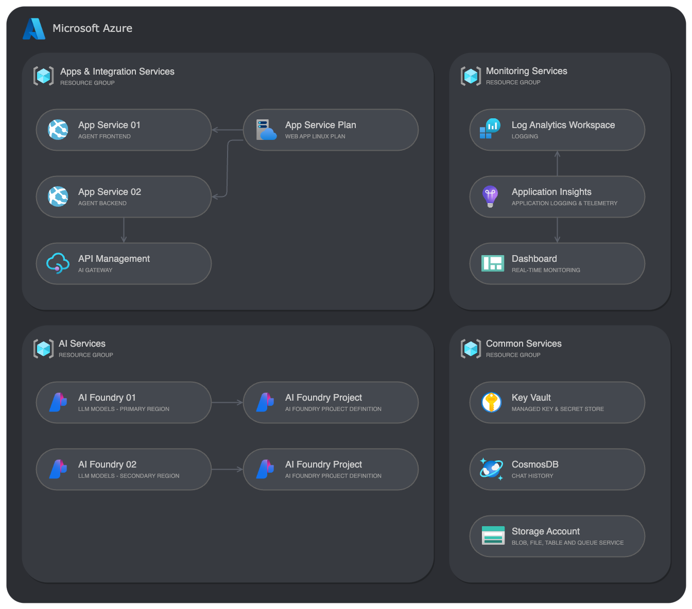
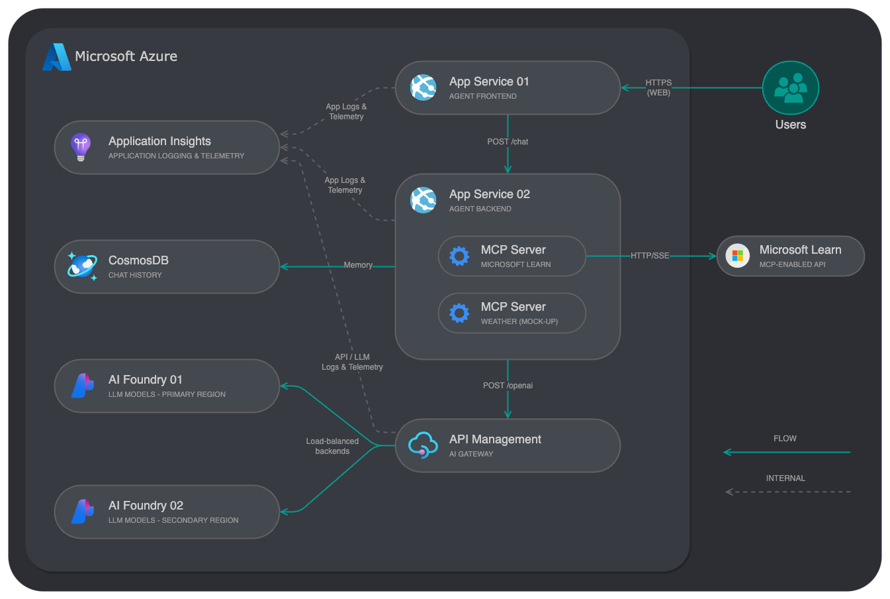

# Semantic Kernel AI Agent with AI Gateway

[](https://codespaces.new/ffilardi-insight/semantic-kernel-agent) [](https://vscode.dev/redirect?url=vscode://ms-vscode-remote.remote-containers/cloneInVolume?url=https://github.com/ffilardi-insight/semantic-kernel-agent)

[Features](./doc/features.md) • [Getting Started](./doc/getting-started.md) • [Quickstart](./doc/quickstart.md) • [Guidance](./doc/guidance.md)

## Overview
This template provides a complete foundation for building intelligent AI agents using [Microsoft Semantic Kernel SDK](https://github.com/microsoft/semantic-kernel) for Python with Azure AI Foundry integration. The solution features a two-tier architecture with a FastAPI-based backend agent and a web-based frontend, all deployed on Azure App Service.

The solution also implements the [AI Gateway](https://github.com/Azure-Samples/AI-Gateway/) patterns and capabilities of Azure API Management service, including secure load-balanced backend AI models access and policies for requests, token quotas and limits.

The deployment follows a multi-resource group design with infrastructure-as-code using Azure Bicep modules, providing enterprise-grade security, monitoring, and scalability.



### Project Documentation

- **[Features](./doc/features.md)** - Detailed overview of AI agent backend, frontend, infrastructure services and security features
- **[Getting Started](./doc/getting-started.md)** - Setup options including GitHub Codespaces, VS Code Dev Containers, and local environment
- **[Quickstart](./doc/quickstart.md)** - Provisioning, local development, extending the solution, and cleanup
- **[Guidance](./doc/guidance.md)** - Region availability, quotas, dependencies, configuration, monitoring, security and performance

### Project Structure

```
semantic-kernel-agent/
├── src/
│   ├── agent_backend/                  # AI Agent Backend Service
│   │   ├── app.py                      # FastAPI application entry point
│   │   ├── routes/
│   │   │   └── chat.py                 # Chat endpoint handler
│   │   ├── services/
│   │   │   ├── agent.py                # Semantic Kernel agent initialization
│   │   │   ├── kernel.py               # Kernel configuration
│   │   │   ├── conversation_store.py   # Cosmos DB memory
│   │   │   └── tool_tracker.py         # Plugin invocation tracking
│   │   ├── mcp_plugins/
│   │   │   ├── mcp_microsoft_learn.py  # Microsoft Learn MCP plugin
│   │   │   └── mcp_weather.py          # Weather MCP plugin
│   │   ├── schemas/
│   │   │   └── chat.py                 # Pydantic request/response models
│   │   ├── Dockerfile                  # Container definition
│   │   └── requirements.txt            # Python dependencies
│   ├── agent_frontend/                 # Web Frontend Service
│   │   ├── app.py                      # FastAPI web application
│   │   ├── templates/
│   │   │   └── index.html              # Chat UI template
│   │   ├── static/
│   │   │   └── styles.css              # UI styling
│   │   ├── Dockerfile                  # Container definition
│   │   └── requirements.txt            # Python dependencies
│   └── docker-compose.yml              # Local development composition
├── infra/                              # Infrastructure as Code
│   ├── main.bicep                      # Main orchestration file
│   ├── main.parameters.json            # Environment parameters
│   └── modules/
│       ├── ai/                         # AI Foundry & model deployments
│       ├── apim/                       # API Management configuration
│       │   ├── api/                    # API definitions
│       │   └── policies/               # APIM policies
│       ├── app/                        # App Service resources
│       ├── cosmosdb/                   # Cosmos DB configuration
│       ├── keyvault/                   # Key Vault configuration
│       ├── monitor/                    # Monitoring & logging
│       ├── security/                   # RBAC configurations
│       └── storage/                    # Storage account
├── doc/                                # Documentation
├── azure.yaml                          # Azure Developer CLI configuration
└── README.md
```

## Architecture

### Overview



**Request Flow:**
1. User enters a question in the frontend chat interface
2. Frontend sends POST request to backend `/chat` endpoint with session ID and user input
3. Backend agent retrieves conversation history from Cosmos DB
4. Semantic Kernel processes the input using configured plugins
5. Agent may invoke MCP plugins (Microsoft Learn docs, weather data) as needed
6. AI model response is generated via APIM-proxied Azure AI Foundry endpoints
7. Response is persisted to Cosmos DB with tool usage tracking
8. Backend returns response with answer, used tools, and token metrics
9. Frontend displays the response in the chat interface

### API Management

APIM acts as an intelligent load balancer for Azure OpenAI model deployments:

- **Round-Robin Distribution:** Requests are distributed across multiple model deployment instances
- **Retry Logic:** Automatic retry on transient failures (429, 503 errors)
- **Backend Selection:** Policy-based routing to available model endpoints
- **Monitoring:** Full telemetry through Application Insights

#### API Management Configuration

| Component | Description |
|------|-------------|
| [APIM Load Balancing](doc/load-balancing.md) | Load balancing types, configuration options, and traffic distribution strategies for Azure OpenAI model deployments |
| [APIM Load Balancing Examples](doc/load-balancing-examples.md) | Bicep configuration examples for round-robin, weighted, and priority-based load balancing scenarios |
| [APIM Policies](doc/apim-policies.md) | APIM policy definitions for managed identity authentication, rate limiting, token quotas, and security controls |
| [APIM Application Insights](doc/apim-app-insights.md) | Application Insights integration setup for API-level logging, sampling, and monitoring configuration |
| [APIM Azure Monitor](doc/apim-azure-monitor.md) | Azure Monitor integration setup for API-level logging, sampling, and monitoring configuration including LLM messages |


## Costs

You can estimate the cost of this project's architecture with [Azure's pricing calculator](https://azure.microsoft.com/pricing/calculator/).

**Key cost components:**
- **Azure OpenAI/AI Foundry:** Pay-per-token pricing based on model and usage
- **API Management:** Developer SKU for development/testing
- **App Service:** Linux-based plan (shared across frontend and backend)
- **Cosmos DB:** Request Units (RU/s) based on conversation activity
- **Application Insights:** Data ingestion and retention
- **Key Vault:** Transaction-based pricing
- **Storage Account:** Minimal cost for blob/table/queue storage

**Cost optimization tips:**
- Use GPT-4.1-mini for lower token costs when appropriate
- Limit conversation history (max_items) to reduce Cosmos DB RU consumption
- Use APIM Standard SKU for production (caching, higher limits)
- Configure Application Insights sampling in high-traffic scenarios

## Resources

**Microsoft Semantic Kernel:**
* [Semantic Kernel Documentation](https://learn.microsoft.com/semantic-kernel/)
* [Semantic Kernel Python SDK](https://github.com/microsoft/semantic-kernel/tree/main/python)
* [Model Context Protocol (MCP)](https://modelcontextprotocol.io/)

**Azure Services:**
* [Azure Developer CLI (azd)](https://learn.microsoft.com/azure/developer/azure-developer-cli/)
* [Azure AI Foundry](https://learn.microsoft.com/azure/ai-studio/)
* [Azure OpenAI Service](https://learn.microsoft.com/azure/ai-services/openai/)
* [Azure API Management](https://learn.microsoft.com/azure/api-management/)
* [Azure App Service (Python)](https://learn.microsoft.com/azure/app-service/quickstart-python)
* [Azure Cosmos DB](https://learn.microsoft.com/azure/cosmos-db/)
* [Azure Application Insights](https://learn.microsoft.com/azure/azure-monitor/app/app-insights-overview)

**Development Tools:**
* [FastAPI Documentation](https://fastapi.tiangolo.com/)
* [Pydantic Documentation](https://docs.pydantic.dev/)
* [Bicep Documentation](https://learn.microsoft.com/azure/azure-resource-manager/bicep/)
* [Azure Well-Architected Framework](https://learn.microsoft.com/azure/well-architected/)
